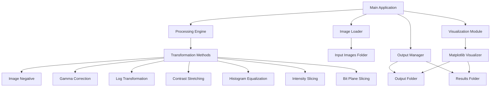
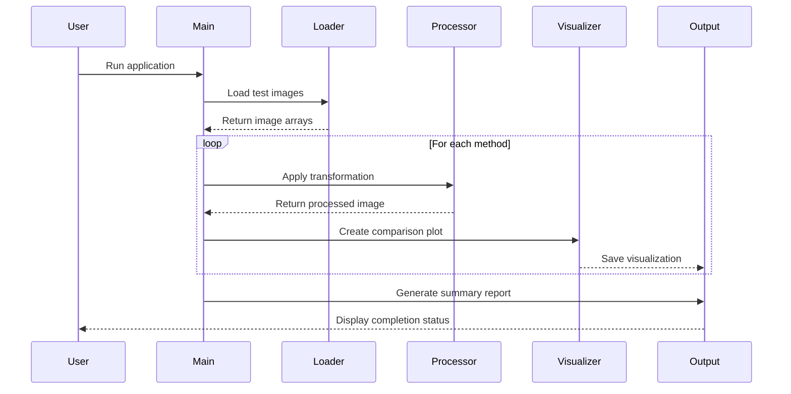

# Design Document: Image Processing Methods

## Overview

This design document outlines the implementation of 7 fundamental image processing methods for a Digital Image Processing assignment. The system will process both RGB and grayscale images using NumPy and OpenCV, applying transformations including Image Negative, Gamma Correction, Logarithmic Transformation, Contrast Stretching, Histogram Equalization, Intensity Level Slicing, and Bit Plane Slicing. The implementation will generate visualizations comparing input and output images, with results organized in a structured folder hierarchy for easy demonstration and reporting.

## Architecture



## Main Workflow



## Components and Interfaces

### Component 1: ImageLoader

**Purpose**: Handle loading and validation of input images

**Interface**:
```python
class ImageLoader:
    def load_image(self, filepath: str, mode: str = 'color') -> np.ndarray:
        """Load image from file"""
        pass
    
    def validate_image(self, image: np.ndarray) -> bool:
        """Validate image array"""
        pass
    
    def convert_to_grayscale(self, image: np.ndarray) -> np.ndarray:
        """Convert RGB to grayscale"""
        pass
    
    def load_batch(self, folder: str) -> List[Tuple[str, np.ndarray]]:
        """Load multiple images from folder"""
        pass
```

**Responsibilities**:
- Load images from disk using OpenCV
- Validate image format and dimensions
- Convert between color spaces (RGB/Grayscale)
- Handle batch loading for multiple test images

### Component 2: ImageProcessor

**Purpose**: Apply image processing transformations

**Interface**:
```python
class ImageProcessor:
    def image_negative(self, image: np.ndarray) -> np.ndarray:
        """Apply image negative transformation"""
        pass
    
    def gamma_correction(self, image: np.ndarray, gamma: float) -> np.ndarray:
        """Apply gamma encoding/correction"""
        pass
    
    def log_transformation(self, image: np.ndarray, c: float = 1.0) -> np.ndarray:
        """Apply logarithmic transformation"""
        pass
    
    def contrast_stretching(self, image: np.ndarray, r1: int, s1: int, 
                           r2: int, s2: int) -> np.ndarray:
        """Apply contrast stretching"""
        pass
    
    def histogram_equalization(self, image: np.ndarray) -> np.ndarray:
        """Apply histogram equalization"""
        pass
    
    def intensity_level_slicing(self, image: np.ndarray, lower: int, 
                                upper: int, preserve: bool = True) -> np.ndarray:
        """Apply intensity level slicing"""
        pass
    
    def bit_plane_slicing(self, image: np.ndarray, plane: int) -> np.ndarray:
        """Extract specific bit plane"""
        pass
```

**Responsibilities**:
- Implement all 7 image processing methods
- Handle both RGB and grayscale images
- Ensure output values are in valid range [0, 255]
- Maintain image dimensions and type consistency

### Component 3: Visualizer

**Purpose**: Create visual comparisons of input and output images

**Interface**:
```python
class Visualizer:
    def plot_comparison(self, original: np.ndarray, processed: np.ndarray,
                       title: str, method_name: str) -> None:
        """Create side-by-side comparison plot"""
        pass
    
    def plot_histogram(self, image: np.ndarray, title: str) -> None:
        """Plot image histogram"""
        pass
    
    def plot_bit_planes(self, image: np.ndarray, planes: List[np.ndarray]) -> None:
        """Plot all 8 bit planes"""
        pass
    
    def save_figure(self, filepath: str) -> None:
        """Save current figure to file"""
        pass
```

**Responsibilities**:
- Generate matplotlib visualizations
- Create side-by-side comparisons
- Plot histograms for equalization method
- Display all bit planes for bit plane slicing
- Save figures in high resolution

### Component 4: OutputManager

**Purpose**: Manage output folder structure and file organization

**Interface**:
```python
class OutputManager:
    def setup_folders(self) -> None:
        """Create output directory structure"""
        pass
    
    def save_processed_image(self, image: np.ndarray, method: str, 
                            filename: str) -> str:
        """Save processed image to appropriate folder"""
        pass
    
    def generate_summary_report(self, results: Dict) -> None:
        """Generate summary of all processing results"""
        pass
```

**Responsibilities**:
- Create organized folder structure
- Save processed images with descriptive names
- Generate summary report for PPT creation
- Maintain consistent naming conventions

## Data Models

### ImageData

```python
from dataclasses import dataclass
from typing import Optional

@dataclass
class ImageData:
    filename: str
    original: np.ndarray
    processed: Optional[np.ndarray] = None
    method: Optional[str] = None
    parameters: Optional[Dict] = None
    is_grayscale: bool = False
```

**Validation Rules**:
- filename must be non-empty string
- original must be valid numpy array with shape (H, W) or (H, W, 3)
- processed must have same dimensions as original
- method must be one of the 7 supported methods

### ProcessingResult

```python
@dataclass
class ProcessingResult:
    method_name: str
    input_image: np.ndarray
    output_image: np.ndarray
    parameters: Dict
    execution_time: float
    output_path: str
```

**Validation Rules**:
- method_name must be valid method identifier
- input_image and output_image must have compatible shapes
- execution_time must be non-negative
- output_path must be valid file path

## Algorithmic Pseudocode

### Algorithm 1: Image Negative

```python
def image_negative(image: np.ndarray) -> np.ndarray:
    """
    Apply image negative transformation.
    
    Preconditions:
    - image is valid numpy array
    - image values in range [0, 255]
    - image dtype is uint8
    
    Postconditions:
    - output has same shape as input
    - output values in range [0, 255]
    - for each pixel: output[i,j] = 255 - input[i,j]
    
    Loop Invariants: N/A (vectorized operation)
    """
    # Formula: s = L - 1 - r
    # where L = 256 (number of intensity levels)
    # r = input pixel value
    # s = output pixel value
    
    return 255 - image
```

### Algorithm 2: Gamma Correction

```python
def gamma_correction(image: np.ndarray, gamma: float) -> np.ndarray:
    """
    Apply gamma encoding/correction.
    
    Preconditions:
    - image is valid numpy array with values [0, 255]
    - gamma > 0 (typically 0.1 to 5.0)
    - gamma < 1: brightens image
    - gamma > 1: darkens image
    - gamma = 1: no change
    
    Postconditions:
    - output has same shape as input
    - output values in range [0, 255]
    - transformation follows power law: s = c * r^gamma
    
    Loop Invariants: N/A (vectorized operation)
    """
    # Normalize to [0, 1]
    normalized = image / 255.0
    
    # Apply power law transformation
    # Formula: s = c * r^gamma (where c = 1)
    corrected = np.power(normalized, gamma)
    
    # Scale back to [0, 255]
    output = np.uint8(corrected * 255)
    
    return output
```

### Algorithm 3: Logarithmic Transformation

```python
def log_transformation(image: np.ndarray, c: float = 1.0) -> np.ndarray:
    """
    Apply logarithmic transformation.
    
    Preconditions:
    - image is valid numpy array with values [0, 255]
    - c > 0 (scaling constant)
    
    Postconditions:
    - output has same shape as input
    - output values in range [0, 255]
    - transformation follows: s = c * log(1 + r)
    - expands dark pixel values, compresses bright values
    
    Loop Invariants: N/A (vectorized operation)
    """
    # Formula: s = c * log(1 + r)
    # Adding 1 prevents log(0) which is undefined
    
    # Normalize to [0, 1]
    normalized = image / 255.0
    
    # Apply log transformation
    transformed = c * np.log1p(normalized)
    
    # Normalize to [0, 255]
    output = np.uint8(255 * transformed / np.max(transformed))
    
    return output
```

### Algorithm 4: Contrast Stretching

```python
def contrast_stretching(image: np.ndarray, r1: int, s1: int, 
                       r2: int, s2: int) -> np.ndarray:
    """
    Apply contrast stretching (piecewise linear transformation).
    
    Preconditions:
    - image is valid numpy array with values [0, 255]
    - 0 <= r1 < r2 <= 255 (input control points)
    - 0 <= s1 < s2 <= 255 (output control points)
    - r1, r2 define input intensity range
    - s1, s2 define output intensity range
    
    Postconditions:
    - output has same shape as input
    - output values in range [0, 255]
    - piecewise linear mapping applied
    - contrast enhanced in [r1, r2] range
    
    Loop Invariants:
    - For each pixel, exactly one of three conditions applies
    - Output value determined by corresponding linear segment
    """
    output = np.zeros_like(image, dtype=np.float32)
    
    # Three-segment piecewise linear function:
    # Segment 1: [0, r1] -> [0, s1]
    # Segment 2: [r1, r2] -> [s1, s2] (main contrast stretch)
    # Segment 3: [r2, 255] -> [s2, 255]
    
    # Segment 1: r < r1
    mask1 = image < r1
    if r1 > 0:
        output[mask1] = (s1 / r1) * image[mask1]
    
    # Segment 2: r1 <= r <= r2 (main stretch)
    mask2 = (image >= r1) & (image <= r2)
    if r2 > r1:
        output[mask2] = ((s2 - s1) / (r2 - r1)) * (image[mask2] - r1) + s1
    
    # Segment 3: r > r2
    mask3 = image > r2
    if r2 < 255:
        output[mask3] = ((255 - s2) / (255 - r2)) * (image[mask3] - r2) + s2
    
    return np.uint8(np.clip(output, 0, 255))
```

### Algorithm 5: Histogram Equalization

```python
def histogram_equalization(image: np.ndarray) -> np.ndarray:
    """
    Apply histogram equalization.
    
    Preconditions:
    - image is valid numpy array with values [0, 255]
    - image is grayscale (single channel)
    
    Postconditions:
    - output has same shape as input
    - output values in range [0, 255]
    - output histogram is approximately uniform
    - cumulative distribution function is linearized
    
    Loop Invariants:
    - Histogram sum equals total number of pixels
    - CDF is monotonically increasing
    - All intensity levels processed exactly once
    """
    # Step 1: Compute histogram
    hist, bins = np.histogram(image.flatten(), 256, [0, 256])
    
    # Step 2: Compute cumulative distribution function (CDF)
    cdf = hist.cumsum()
    
    # Step 3: Normalize CDF to [0, 255]
    # Formula: h(v) = round((cdf(v) - cdf_min) / (M*N - cdf_min) * 255)
    # where M*N is total number of pixels
    cdf_min = cdf[cdf > 0].min()
    cdf_normalized = ((cdf - cdf_min) * 255) / (cdf[-1] - cdf_min)
    
    # Step 4: Map original values to equalized values
    output = np.uint8(cdf_normalized[image])
    
    return output
```

### Algorithm 6: Intensity Level Slicing

```python
def intensity_level_slicing(image: np.ndarray, lower: int, upper: int,
                           preserve: bool = True) -> np.ndarray:
    """
    Apply intensity level slicing.
    
    Preconditions:
    - image is valid numpy array with values [0, 255]
    - 0 <= lower < upper <= 255
    - preserve is boolean flag
    
    Postconditions:
    - output has same shape as input
    - output values in range [0, 255]
    - if preserve=True: background preserved, range highlighted
    - if preserve=False: binary output (0 or 255)
    
    Loop Invariants:
    - Each pixel classified as either in-range or out-of-range
    - Classification is mutually exclusive
    """
    output = np.zeros_like(image)
    
    if preserve:
        # Mode 1: Highlight range, preserve background
        # Pixels in [lower, upper] -> 255 (white)
        # Pixels outside range -> original value
        output = image.copy()
        mask = (image >= lower) & (image <= upper)
        output[mask] = 255
    else:
        # Mode 2: Binary slicing
        # Pixels in [lower, upper] -> 255 (white)
        # Pixels outside range -> 0 (black)
        mask = (image >= lower) & (image <= upper)
        output[mask] = 255
    
    return output
```

### Algorithm 7: Bit Plane Slicing

```python
def bit_plane_slicing(image: np.ndarray, plane: int) -> np.ndarray:
    """
    Extract specific bit plane from image.
    
    Preconditions:
    - image is valid numpy array with values [0, 255]
    - 0 <= plane <= 7 (8 bit planes for uint8)
    - plane 0 = LSB (least significant bit)
    - plane 7 = MSB (most significant bit)
    
    Postconditions:
    - output has same shape as input
    - output values are binary (0 or 255)
    - extracted bit plane represents 2^plane contribution
    
    Loop Invariants: N/A (vectorized bitwise operation)
    """
    # Extract bit plane using bitwise AND with mask
    # Mask = 2^plane (single bit set at position 'plane')
    # Example: plane=3 -> mask=8 (binary: 00001000)
    
    mask = 1 << plane  # 2^plane
    bit_plane = (image & mask) >> plane  # Extract and shift to LSB
    
    # Scale to [0, 255] for visualization
    output = bit_plane * 255
    
    return np.uint8(output)

def extract_all_bit_planes(image: np.ndarray) -> List[np.ndarray]:
    """
    Extract all 8 bit planes.
    
    Preconditions:
    - image is valid numpy array with values [0, 255]
    
    Postconditions:
    - returns list of 8 numpy arrays
    - each array represents one bit plane
    - planes ordered from LSB (0) to MSB (7)
    
    Loop Invariants:
    - Each iteration extracts exactly one bit plane
    - Plane index increases monotonically
    - All planes have same shape as input
    """
    planes = []
    for i in range(8):
        plane = bit_plane_slicing(image, i)
        planes.append(plane)
    return planes
```

## Example Usage

### Example 1: Processing Single Image with All Methods

```python
import numpy as np
import cv2
from image_processor import ImageProcessor
from visualizer import Visualizer

# Load image
image = cv2.imread('images/input/sample.jpg', cv2.IMREAD_GRAYSCALE)

# Initialize processor
processor = ImageProcessor()
visualizer = Visualizer()

# Apply each method
negative = processor.image_negative(image)
gamma = processor.gamma_correction(image, gamma=0.5)
log_trans = processor.log_transformation(image, c=1.0)
contrast = processor.contrast_stretching(image, r1=50, s1=0, r2=200, s2=255)
hist_eq = processor.histogram_equalization(image)
intensity_slice = processor.intensity_level_slicing(image, lower=100, upper=200)
bit_plane = processor.bit_plane_slicing(image, plane=7)

# Visualize results
visualizer.plot_comparison(image, negative, "Image Negative", "negative")
visualizer.plot_comparison(image, gamma, "Gamma Correction (γ=0.5)", "gamma")
# ... continue for all methods
```

### Example 2: Batch Processing Multiple Images

```python
from pathlib import Path
from image_loader import ImageLoader
from output_manager import OutputManager

# Setup
loader = ImageLoader()
processor = ImageProcessor()
output_mgr = OutputManager()
output_mgr.setup_folders()

# Load all test images
images = loader.load_batch('images/input/')

# Process each image with each method
for filename, image in images:
    # Convert to grayscale if needed
    if len(image.shape) == 3:
        gray = loader.convert_to_grayscale(image)
    else:
        gray = image
    
    # Apply all methods
    results = {
        'negative': processor.image_negative(gray),
        'gamma': processor.gamma_correction(gray, gamma=0.5),
        'log': processor.log_transformation(gray),
        'contrast': processor.contrast_stretching(gray, 50, 0, 200, 255),
        'histogram': processor.histogram_equalization(gray),
        'intensity': processor.intensity_level_slicing(gray, 100, 200),
        'bitplane': processor.bit_plane_slicing(gray, 7)
    }
    
    # Save results
    for method, result in results.items():
        output_mgr.save_processed_image(result, method, filename)
```

### Example 3: RGB Image Processing

```python
def process_rgb_image(image_rgb: np.ndarray, method: str) -> np.ndarray:
    """Process RGB image by applying method to each channel"""
    
    # Split into channels
    b, g, r = cv2.split(image_rgb)
    
    # Apply method to each channel
    if method == 'negative':
        b_proc = processor.image_negative(b)
        g_proc = processor.image_negative(g)
        r_proc = processor.image_negative(r)
    elif method == 'gamma':
        b_proc = processor.gamma_correction(b, gamma=0.5)
        g_proc = processor.gamma_correction(g, gamma=0.5)
        r_proc = processor.gamma_correction(r, gamma=0.5)
    # ... handle other methods
    
    # Merge channels
    result = cv2.merge([b_proc, g_proc, r_proc])
    return result
```

## Folder Structure

```
image-processing-methods/
├── images/
│   ├── input/                    # Test images
│   │   ├── low_contrast.jpg
│   │   ├── dark_image.jpg
│   │   ├── bright_image.jpg
│   │   ├── medical_xray.jpg
│   │   └── natural_scene.jpg
│   ├── output/                   # Processed images
│   │   ├── negative/
│   │   ├── gamma/
│   │   ├── log/
│   │   ├── contrast/
│   │   ├── histogram/
│   │   ├── intensity/
│   │   └── bitplane/
│   └── results/                  # Visualizations for PPT
│       ├── negative_comparison.png
│       ├── gamma_comparison.png
│       └── ...
├── src/
│   ├── __init__.py
│   ├── image_loader.py          # ImageLoader class
│   ├── image_processor.py       # ImageProcessor class
│   ├── visualizer.py            # Visualizer class
│   ├── output_manager.py        # OutputManager class
│   └── main.py                  # Main application
├── tests/
│   ├── test_processor.py
│   └── test_loader.py
├── requirements.txt
└── README.md
```

## Correctness Properties

### Universal Properties

1. **Value Range Preservation**: ∀ image, method: 0 ≤ process(image, method)[i,j] ≤ 255
2. **Shape Preservation**: ∀ image, method: process(image, method).shape == image.shape
3. **Type Consistency**: ∀ image, method: process(image, method).dtype == np.uint8
4. **Determinism**: ∀ image, method, params: process(image, method, params) == process(image, method, params)

### Method-Specific Properties

1. **Image Negative**: ∀ pixel p: negative(p) + p == 255
2. **Gamma Correction**: ∀ gamma > 0: gamma_correct(image, 1.0) == image
3. **Log Transformation**: ∀ pixel p: log_transform(0) == 0
4. **Contrast Stretching**: ∀ r1, r2, s1, s2: min(output) ≥ 0 ∧ max(output) ≤ 255
5. **Histogram Equalization**: ∀ image: variance(hist_eq(image)) ≥ variance(image)
6. **Intensity Slicing**: ∀ lower, upper: count(output == 255) ≤ count((image ≥ lower) ∧ (image ≤ upper))
7. **Bit Plane Slicing**: ∀ plane ∈ [0,7]: bit_plane(image, plane) ∈ {0, 255}

## Error Handling

### Error Scenario 1: Invalid Image Input

**Condition**: Image file not found or corrupted
**Response**: Raise FileNotFoundError with descriptive message
**Recovery**: Skip to next image in batch processing, log error

### Error Scenario 2: Invalid Parameters

**Condition**: Parameters out of valid range (e.g., gamma ≤ 0, plane > 7)
**Response**: Raise ValueError with parameter constraints
**Recovery**: Use default parameters, warn user

### Error Scenario 3: Memory Error

**Condition**: Image too large to process
**Response**: Catch MemoryError, suggest image resizing
**Recovery**: Resize image to maximum supported dimensions

### Error Scenario 4: Output Folder Permission

**Condition**: Cannot write to output folder
**Response**: Raise PermissionError with folder path
**Recovery**: Attempt to create alternative output location

## Testing Strategy

### Unit Testing Approach

Test each image processing method independently:
- Test with synthetic images (all zeros, all ones, gradients)
- Verify output range [0, 255]
- Verify shape preservation
- Test edge cases (empty image, single pixel, very large image)
- Test parameter boundaries

### Property-Based Testing Approach

**Property Test Library**: hypothesis (Python)

**Properties to Test**:
1. **Idempotency**: Some methods applied twice should equal once (e.g., negative(negative(img)) == img)
2. **Commutativity**: Order independence where applicable
3. **Range Invariance**: Output always in [0, 255]
4. **Shape Invariance**: Output shape always equals input shape
5. **Reversibility**: Some methods should be reversible (negative, specific gamma pairs)

**Example Property Test**:
```python
from hypothesis import given, strategies as st
import hypothesis.extra.numpy as npst

@given(npst.arrays(dtype=np.uint8, shape=(100, 100)))
def test_negative_is_involutive(image):
    """Test that applying negative twice returns original"""
    result = processor.image_negative(processor.image_negative(image))
    assert np.array_equal(result, image)

@given(npst.arrays(dtype=np.uint8, shape=(100, 100)))
def test_output_range(image):
    """Test that all methods produce valid output range"""
    methods = [
        processor.image_negative,
        lambda img: processor.gamma_correction(img, 0.5),
        processor.log_transformation,
        processor.histogram_equalization
    ]
    for method in methods:
        result = method(image)
        assert np.all(result >= 0) and np.all(result <= 255)
```

### Integration Testing Approach

Test complete workflow:
- Load multiple images from folder
- Apply all 7 methods to each image
- Verify all output files created
- Verify visualizations generated
- Check folder structure created correctly
- Validate summary report generation

## Performance Considerations

1. **Vectorization**: Use NumPy vectorized operations instead of loops for 10-100x speedup
2. **Memory Management**: Process images in batches if dealing with large datasets
3. **Caching**: Cache histogram calculations for repeated operations
4. **Parallel Processing**: Use multiprocessing for batch processing multiple images
5. **Image Resizing**: Provide option to resize large images before processing

**Expected Performance**:
- Single image (1024x768): < 100ms per method
- Batch processing (10 images): < 5 seconds total
- Visualization generation: < 500ms per comparison plot

## Security Considerations

1. **Input Validation**: Validate image file types (jpg, png, bmp only)
2. **Path Traversal**: Sanitize file paths to prevent directory traversal attacks
3. **Resource Limits**: Limit maximum image dimensions to prevent memory exhaustion
4. **File Permissions**: Set appropriate permissions on output files (read-only for results)

## Dependencies

**Core Libraries**:
- numpy >= 1.21.0 (numerical operations)
- opencv-python >= 4.5.0 (image I/O and processing)
- matplotlib >= 3.4.0 (visualization)

**Development Libraries**:
- pytest >= 7.0.0 (unit testing)
- hypothesis >= 6.0.0 (property-based testing)
- black >= 22.0.0 (code formatting)
- mypy >= 0.950 (type checking)

**Optional Libraries**:
- pillow >= 9.0.0 (alternative image I/O)
- scikit-image >= 0.19.0 (additional processing utilities)
- seaborn >= 0.11.0 (enhanced visualizations)

## Recommended Test Images

1. **Low Contrast Image**: For contrast stretching and histogram equalization
2. **Dark Image**: For gamma correction (γ < 1) and log transformation
3. **Bright Image**: For gamma correction (γ > 1)
4. **Medical X-ray**: For intensity level slicing
5. **Natural Scene**: For general method demonstration
6. **Text Document**: For bit plane slicing demonstration
7. **High Dynamic Range**: For log transformation

Each method should be tested with at least 2-3 different images to clearly demonstrate its effect.
